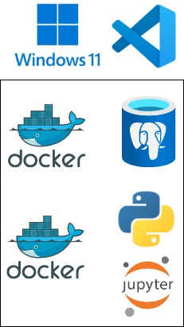
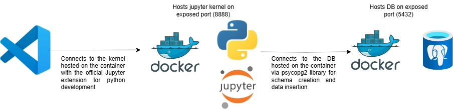

## 🧑‍💻 Codecademy Data Engineering Project 

---
### 📖 Overview
This repository contains a project created as part of the **Codecademy Data Engineering Career Path**.  
It is intended for **educational purposes only** and demonstrates concepts learned during the course.

---

### 📝 Purpose
The goal of this project is to **practice and apply data engineering skills**, including:

- Data extraction, transformation, and loading (**ETL**)
- Working with **databases and SQL**
- Data analysis and processing using **Python**
- Building **data pipelines**
- Environment **containerization**

---

### ⚠️ Disclaimer
This project is **not intended for production use**.  
All datasets and examples are for **learning and practice purposes only**.

---

### 🛠️ Technologies used, architecture and development workflow
- Docker
- Python
- PostgreSQL  
- VS Code
- Jupyter Notebook  



The project was developed on a local **VS Code** installation that used **docker containers** to host the **jupyter kernel** for python and a **PostgreSQL** database.



---

### 📂 Setup
**1.** Clone the repository:
   ```bash
   git clone git@github.com:sebasgw/bike-rental-starter-kit.git
   ```

**2.** Create .env file for postgres info in /docker that contains:
   ```bash
POSTGRES_USER=
POSTGRES_PASSWORD=
POSTGRES_DB=
POSTGRES_HOST=
POSTGRES_PORT=
   ```

**3.** Run docker commands to download and build images:
   ```bash
   cd bike-rental-starter-kit/docker
   docker compose up --build -d
   ```

> **Note:** This step requires docker engine installed and running.

### 🪧 General usage


**1.** Install **VS Code** and the **Official Jupyter** extension.

**2.** Open the notebook provided in the repository and on the kernel options (section located at the top right) choose **Select Another Kernel** and type in **localhost:8888**.

**3.** Explore the dataset, analyze data and run queries at will.

**4.** Connect to PostgreSQL database: Use your preferred client to connect to the database and interact with the tables once the entire notebook is run (it creates the DB schema and inserts the data).